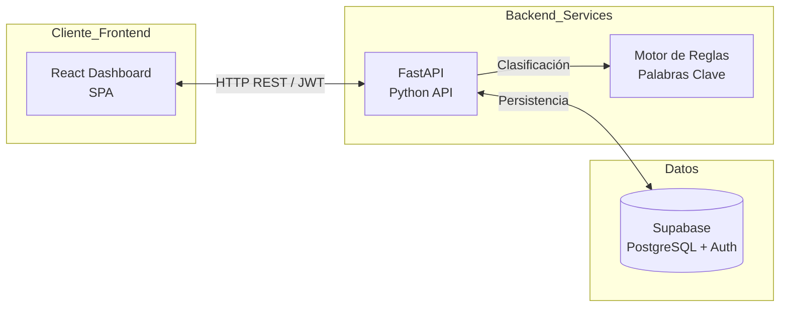
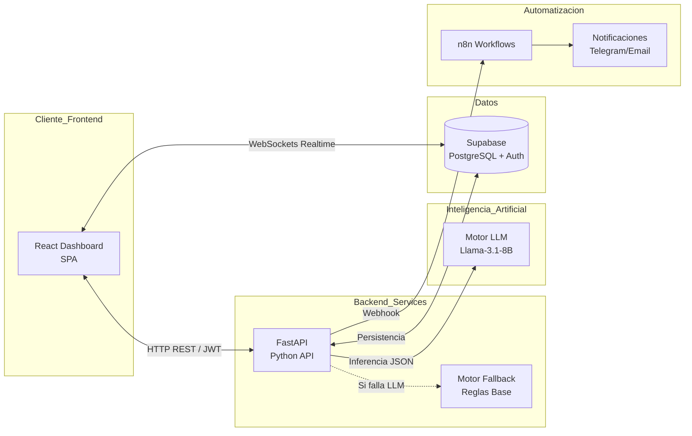

# **2\. Definición de la Arquitectura y Stack Tecnológico**

## **2.1 Stack Tecnológico - Semestre I (Alcance Actual)**

El proyecto se construye sobre una arquitectura de microservicios y tecnologías modernas:

| Componente | Tecnología | Descripción |
|------------|------------|-------------|
| **Frontend** | React 18, Vite, Tailwind CSS, Framer Motion | Dashboard SPA con tema claro/oscuro, búsqueda y paginación |
| **Backend** | FastAPI (Python), Pydantic, Uvicorn | API REST asíncrona con autenticación JWT |
| **Base de Datos & Auth** | Supabase (PostgreSQL) | RLS (Row Level Security), perfiles con roles (Cliente, Agente, Administrador) |
| **Clasificación** | Motor de reglas (Python if/else) | Palabras clave como línea base para comparación futura (Sem 3) |
| **Infraestructura** | Docker Compose | Orquestación local de contenedores |

## **2.2 Stack Proyectado (Semestres 2 y 3)**

| Componente | Tecnología | Cuándo |
|------------|------------|--------|
| **IA (NLP)** | Llama-3.1-8B-Instruct (Hugging Face Router / vLLM) | Semestre 3 |
| **Automatización** | n8n (webhooks, Telegram, Email) | Semestre 2 |
| **Realtime** | Supabase Realtime en Dashboard | Semestre 2 |

## **2.3 Componente Inteligente**

- **Semestre I:** El motor de clasificación es un conjunto de reglas basadas en palabras clave (ej. "internet", "factura", "error"). Sirve como línea base de comparación.
- **Semestre III:** El LLM (Llama-3.1) extraerá categoría y sentimiento mediante *Prompt Engineering*, devolviendo JSON estructurado. Si falla, se usa el motor de reglas como fallback.

## **2.4 Diagrama de Arquitectura - Semestre I**

## **2.5 Diagrama de Arquitectura - Proyecto Completo (Sem 2-3)**

