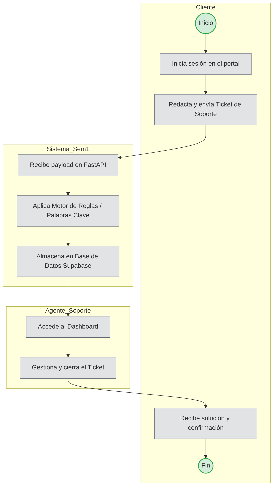
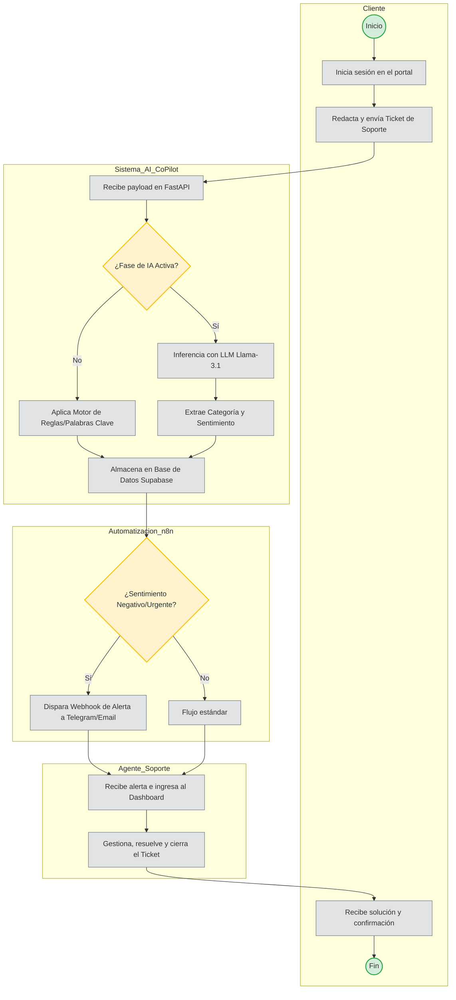

# **3\. Modelado de Procesos (SBPMN)**

Se presentan los diagramas del proceso de negocio simulando el estándar BPMN con "Swimlanes" (Carriles) para identificar las responsabilidades del Cliente, el Sistema, la Automatización y el Agente.

---

## **3.1 Flujo Semestre I (Alcance Actual)**

En el Semestre I el sistema opera **sin IA ni n8n**. La clasificación se realiza únicamente con motor de reglas (palabras clave).

---

## **3.2 Flujo Proyecto Completo (Semestres 2 y 3)**

Cuando se integren IA y n8n, el flujo evoluciona con decisión de fase IA y webhooks de alerta.

