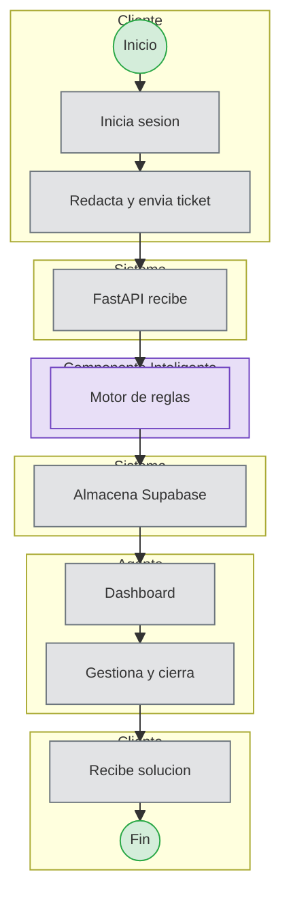
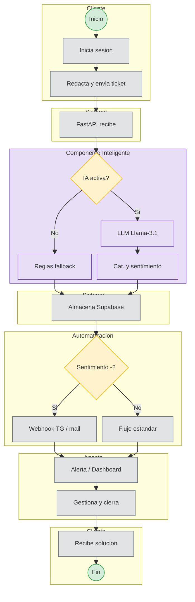

# **3\. Modelado de Procesos (SBPMN)**

Se presentan los diagramas del proceso de negocio simulando el estándar BPMN con "Swimlanes" (Carriles) para identificar las responsabilidades del Cliente, el Sistema, la Automatización y el Agente.

Los diagramas usan **flujo vertical** (`flowchart TB`) con **carriles estrechos** (pocas columnas) para ocupar **menos ancho** en diapositiva y mantener altura contenida.

---

## **3.1 Flujo Semestre I (Alcance Actual)**

En el Semestre I el sistema opera **sin IA ni n8n**. La clasificación se realiza únicamente con motor de reglas (palabras clave).

---

## **3.2 Flujo Proyecto Completo (Semestres 2 y 3)**

Cuando se integren IA y n8n, el flujo evoluciona con decisión de fase IA y webhooks de alerta.

---

### Nota para presentaciones

- **Ancho:** al ir **en columna** (TB), el diagrama suele ocupar **la mitad de ancho** respecto a un LR largo; ajusta zoom en la diapositiva al 80–100 % del alto útil.
- **Exportar:** SVG desde Mermaid Live o desde VS Code; en PowerPoint, **encajar** al marco sin estirar el ancho.
- Si **3.2** se ve alto, coloca **3.1** en una slide y **3.2** en la siguiente.
