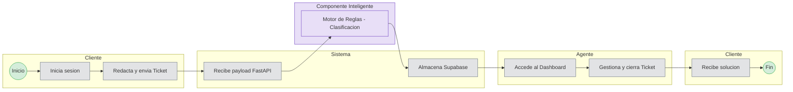

# **3\. Modelado de Procesos (SBPMN)**

Se presentan los diagramas del proceso de negocio simulando el estándar BPMN con "Swimlanes" (Carriles) para identificar las responsabilidades del Cliente, el Sistema, la Automatización y el Agente.

Los diagramas están orientados **de izquierda a derecha** (`flowchart LR`) para facilitar su uso en **diapositivas anchas**.

---

## **3.1 Flujo Semestre I (Alcance Actual)**

En el Semestre I el sistema opera **sin IA ni n8n**. La clasificación se realiza únicamente con motor de reglas (palabras clave).

---

## **3.2 Flujo Proyecto Completo (Semestres 2 y 3)**

Cuando se integren IA y n8n, el flujo evoluciona con decisión de fase IA y webhooks de alerta.

```mermaid
%%{init: {'flowchart': {'nodeSpacing': 22, 'rankSpacing': 36}}}%%
flowchart LR
    subgraph Cliente["Cliente"]
        direction LR
        A((Inicio)) --> B[Inicia sesion] --> C[Redacta y envia Ticket]
    end

    subgraph Sistema["Sistema"]
        direction LR
        D[Recibe payload FastAPI]
    end

    subgraph IA["Componente Inteligente"]
        direction LR
        E{Fase IA activa?}
        E -->|No| F[Motor Reglas Fallback]
        E -->|Si| G[LLM Llama-3.1] --> H[Extrae Cat. y Sentimiento]
    end

    subgraph Sistema2["Sistema"]
        direction LR
        I[Almacena Supabase]
    end

    subgraph Automatizacion["Automatizacion"]
        direction LR
        J{Sentimiento negativo?}
        J -->|Si| K[Webhook Telegram / Email]
        J -->|No| L[Flujo estandar]
    end

    subgraph Agente["Agente"]
        direction LR
        M[Alerta / Dashboard] --> N[Gestiona y cierra Ticket]
    end

    subgraph ClienteFin2["Cliente"]
        direction LR
        O[Recibe solucion] --> P((Fin))
    end

    C --> D --> E
    F --> I
    H --> I
    I --> J
    K --> M
    L --> M
    N --> O

    classDef startEnd fill:#d4edda,stroke:#28a745
    classDef gateway fill:#fff3cd,stroke:#ffc107
    classDef process fill:#e2e3e5,stroke:#6c757d
    classDef intelligent fill:#e8dff7,stroke:#6f42c1
    class A,P startEnd
    class E,J gateway
    class B,C,D,I,K,L,M,N,O process
    class F,G,H intelligent
    style IA fill:#e8dff7,stroke:#6f42c1
```

---

### Nota para presentaciones

- Si el diagrama sigue alto en el visor, exporta a **SVG/PNG ancho** (relación ~16:9) o divide **3.1** y **3.2** en dos diapositivas.
- En Mermaid Live Editor puedes ajustar **width** del canvas antes de exportar.
