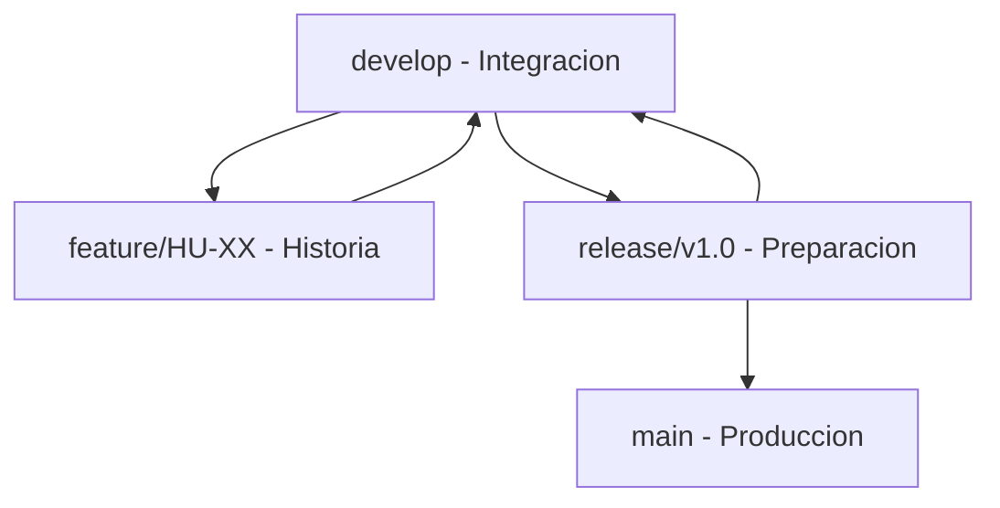

# **4\. Gestión y Configuración del Proyecto**

En esta sección se reportan los accesos a las plataformas de gestión ágil y versionamiento de código utilizadas para el desarrollo del proyecto.

## **4.1 Entorno de Gestión de Proyectos (Jira)**

* **Plataforma:** Jira Software (Atlassian)  
* **Configuración del Proyecto:** Se ha creado el proyecto con la **Plantilla SCRUM**, la cual habilita tableros de Sprints, Product Backlog, estimación en Story Points y flujos de trabajo ágiles.  
* **Enlace y Acceso:** La invitación formal para revisión académica se ha enviado al profesor y asesores correspondientes.  
  * 🔗 [Enlace al Tablero de Jira: AI Support Co-Pilot](https://trabajo-integrador-coding.atlassian.net/jira/your-work) *(Actualizar con la URL real del proyecto)*

## **4.2 Repositorio de Código (GitHub)**

* **Plataforma de Versionamiento:** GitHub  
* **Estructura del Repositorio (Semestre I):** `frontend/`, `python-api/`, `supabase/`. Opcional: `n8n-workflow/` (Semestre 2).  
* **Enlace y Acceso:** Se ha enviado la invitación de lectura/colaboración al profesor designado.  
  * 🔗 [Enlace al Repositorio de GitHub](https://github.com/tu-usuario/ai-support-copilot) *(Actualizar con el link real del repositorio)*

## **4.3 Estrategia de Ramas (GitFlow)**

El proyecto utiliza una variante simplificada de **GitFlow** adaptada a un equipo de un solo desarrollador:

| Rama | Propósito | Protección |
|------|-----------|------------|
| `main` | Código estable en producción. Cada merge representa un release desplegado. | Protegida |
| `develop` | Integración de features. Rama base para desarrollo activo. | Recomendada |
| `feature/HU-XX-descripcion` | Desarrollo de historias de usuario. Se crea desde `develop` y se fusiona de vuelta. | - |
| `release/vX.X.X` | Preparación de release (ajustes finales, versionado). Se crea desde `develop`, se fusiona a `main` y `develop`. | - |
| `hotfix/nombre` | Correcciones urgentes en producción. Se crea desde `main`, se fusiona a `main` y `develop`. | - |

### Flujo de trabajo

### Convención de nombres

- **Features:** `feature/HU-01-registro`, `feature/HU-03-crear-ticket`
- **Releases:** `release/v1.0.0`, `release/sem1-entrega`
- **Hotfixes:** `hotfix/fix-auth-jwt`