# Diagrama de Afinidad — Mesa de Ayuda Inteligente

> Síntesis cualitativa de las 4 entrevistas (10 min cada una) siguiendo el método clásico (Beyer & Holtzblatt, *Contextual Design*) y la guía de Nielsen Norman Group sobre Affinity Diagramming. Se documentan **las 4 etapas** del proceso para que cualquier auditor pueda reconstruirlo.

---

## Marco metodológico

Un Diagrama de Afinidad es una técnica de análisis ascendente (*bottom-up*) que toma observaciones individuales (verbatims, post-its) y las agrupa por similitud temática hasta producir categorías generales. **No se decide la taxonomía a priori**: las categorías emergen del material.

La sesión se realizó en miro.com (tablero privado del estudiante) en **una sesión de 60 minutos**. La materia prima fueron **25 verbatims** extraídos de los anexos finales de cada entrevista (7 + 6 + 6 + 6 = 25).

> Aunque las entrevistas son cortas (10 min), la densidad de verbatims es alta porque la guía está optimizada para extraer 5-7 frases-insight por sesión. La técnica funciona igual con 25 post-its que con 60: lo que cambia es el grano del agrupamiento.

### Convención de colores de los post-its

| Color | Origen |
|-------|--------|
| 🟧 Naranja | Cliente Novata (Sandra Liliana M., 33 años, entrevista 01) — prefijo `N0X` |
| 🟦 Azul | Cliente Avanzada (Daniela Andrea R., 31 años, entrevista 02) — prefijo `A0X` |
| 🟩 Verde | Agente de Soporte (Karen Vanessa G., 28 años, entrevista 03) — prefijo `G0X` |
| 🟪 Morado | Coordinadora (Lina Marcela Q., 34 años, entrevista 04) — prefijo `Q0X` |

> *El color permite, al final, ver qué temas son transversales (post-its de varios colores en un mismo cluster) y cuáles son específicos de un perfil.*

---

## Etapa 1 — Captura: 25 verbatims dispersos en el muro

Se transcribió cada insight de los anexos a un post-it digital. Los post-its se ubicaron de forma aleatoria, sin ningún criterio.

| # | Post-it | Fuente |
|---|---------|--------|
| 1 | Me da miedo dañar algo cuando es una página nueva | 🟧 N01 |
| 2 | Me hicieron repetir el cuento desde el principio | 🟧 N03 |
| 3 | Quiero ver nombre y cara de quien me atiende | 🟧 N06 |
| 4 | Un semáforo grandote en vez de "In Progress" | 🟧 N07 |
| 5 | Que el sistema clasifique pero yo pueda corregir | 🟧 N08 |
| 6 | "24 a 48 horas" es una eternidad — necesito la hora exacta | 🟧 N09 |
| 7 | Botón grandote: Crear Ticket / Ver mis casos | 🟧 N10 |
| 8 | Por escrito queda traza, una llamada me bloquea | 🟦 A02 |
| 9 | Pasos en tiempo real bajaron mi ansiedad | 🟦 A04 |
| 10 | Si me bajas la prioridad, explícame por qué | 🟦 A06 |
| 11 | Una caja negra no la pongo en producción | 🟦 A09 |
| 12 | Sin API ni webhooks, estoy presa | 🟦 A12 |
| 13 | Accesibilidad y SSO desde el día uno | 🟦 A14 |
| 14 | 2-3 minutos categorizando, 50 al día — saquen cuentas | 🟩 G04 |
| 15 | Cabecera fija: usuario, ticket, prioridad, SLA, categoría | 🟩 G07 |
| 16 | Si la máquina decide, la máquina responde, no yo | 🟩 G09 |
| 17 | Plantillas en un .txt que copio y pego | 🟩 G11 |
| 18 | Atajos de teclado: el mouse me roba segundos | 🟩 G13 |
| 19 | Modo oscuro me salva los ojos | 🟩 G15 |
| 20 | Tres KPIs me miden: SLA, CSAT, FCR | 🟪 Q02 |
| 21 | Asignación por carga y skill, no por orden de llegada | 🟪 Q05 |
| 22 | 5 bloques en una sola pantalla del coordinador | 🟪 Q06 |
| 23 | Modo manual para intervenir cualquier automatización | 🟪 Q11 |
| 24 | El reporte mensual lo armo en Excel desde cero | 🟪 Q12 |
| 25 | Detectar clientes frustrados antes que escalen — es plata real | 🟪 Q13 |

📷 **Evidencia fotográfica de la Etapa 1:** [`evidencia_etapa_1_captura.png`](./evidencia_etapa_1_captura.png) *(adjuntar captura de Miro mostrando los 25 post-its dispersos)*.

---

## Etapa 2 — Agrupamiento sin etiqueta (clusters silenciosos)

Sin nombrar ninguna categoría, se movieron post-its parecidos cerca unos de otros. Se hicieron **dos pasadas**:

- **Pasada A (30 min):** primer barrido por «se parecen entre sí». Resultado: 14 mini-clusters.
- **Pasada B (20 min):** se fusionaron clusters que repetían matices. Resultado: 11 clusters consolidados.

📷 **Evidencia fotográfica de la Etapa 2:** [`evidencia_etapa_2_clustering.png`](./evidencia_etapa_2_clustering.png) *(captura de Miro con los clusters formándose, aún sin etiqueta visible)*.

| Cluster temporal | Post-its incluidos | # |
|-------------|---------------------|---|
| Cluster-A | N06 | 1 |
| Cluster-B | N03, A02 | 2 |
| Cluster-C | N07, A04, G07, Q06 | 4 |
| Cluster-D | N09 | 1 |
| Cluster-E | N08, A06, A09, G09, Q11 | 5 |
| Cluster-F | G04, G11 | 2 |
| Cluster-G | Q13 | 1 |
| Cluster-H | A12, A14 | 2 |
| Cluster-I | N01, G15 | 2 |
| Cluster-J | G13, Q12 | 2 |
| Cluster-K | N10, Q02, Q05 | 3 |

> *Nota metodológica:* en esta etapa se evita conscientemente nombrar las categorías para no «sesgar» el agrupamiento. Los nombres llegan en la etapa siguiente.

---

## Etapa 3 — Etiquetado de categorías (bottom-up)

Para cada cluster se discutió qué tenían en común sus post-its y se redactó un nombre que describe la **necesidad subyacente**, no la solución. Las etiquetas resultantes:

| Cluster | Etiqueta final | Necesidad raíz |
|---------|----------------|----------------|
| A | **Canal humano y empatía** | El usuario necesita sentir que hay personas detrás del sistema. |
| B | **Continuidad del contexto** | No tener que repetir información entre interacciones / canales. |
| C | **Información esencial siempre visible** | UI mínima viable: ID, estado, asignado, SLA, categoría. |
| D | **Promesas de tiempo concretas (SLA real)** | Saber CUÁNDO y no en rangos. |
| E | **IA explicable y con override humano** | Confianza, transparencia, posibilidad de corregir. |
| F | **Reducir trabajo repetitivo de bajo valor** | Categorizar y redactar respuestas estándar consume tiempo. |
| G | **Visibilidad emocional y política del ticket** | Ver frustración / criticidad antes de que escale. |
| H | **Integraciones, accesibilidad y autenticación** | SSO, API/webhooks, accesibilidad, exportación, RBAC. |
| I | **UI rápida, tolerante y amigable** | Velocidad, modo oscuro, baja ansiedad para usuarios novatos y agentes cansados. |
| J | **Eficiencia operativa del usuario interno** | Atajos, reporte automático, KPIs justos. |
| K | **Gobernanza, gestión del cambio y métricas** | Coordinación, balanceo de carga, navegación primaria simple. |

📷 **Evidencia fotográfica de la Etapa 3:** [`evidencia_etapa_3_etiquetado.png`](./evidencia_etapa_3_etiquetado.png) *(captura con los 11 clusters ya nombrados)*.

---

## Etapa 4 — Síntesis: temas mayores (super-categorías)

Una segunda lectura permite agrupar los 11 clusters en **4 grandes temas**, que son los pilares de diseño que alimentarán las personas y el USM.

```mermaid
flowchart TB
    classDef tema fill:#fde7c2,stroke:#d4912b,stroke-width:2px,color:#000
    classDef cluster fill:#eef2ff,stroke:#6b7cb6,color:#000

    T1[("Tema 1<br/>Confianza y transparencia")]:::tema
    T2[("Tema 2<br/>Visibilidad y trazabilidad")]:::tema
    T3[("Tema 3<br/>Eficiencia operativa")]:::tema
    T4[("Tema 4<br/>Inclusividad y adopción")]:::tema

    T1 --> CA[Canal humano y empatía]:::cluster
    T1 --> CE[IA explicable y override]:::cluster
    T1 --> CG[Visibilidad emocional y política]:::cluster

    T2 --> CB[Continuidad del contexto]:::cluster
    T2 --> CC[Información esencial visible]:::cluster
    T2 --> CD[Promesas de tiempo concretas]:::cluster

    T3 --> CF[Reducir trabajo repetitivo]:::cluster
    T3 --> CJ[Eficiencia operativa interna]:::cluster
    T3 --> CK[Gobernanza y métricas]:::cluster

    T4 --> CH[Integraciones / accesibilidad / SSO]:::cluster
    T4 --> CI[UI rápida y tolerante]:::cluster
```

### Lectura cruzada por perfil

La distribución de colores en cada tema permite identificar **insights compartidos** vs. **insights específicos**:

| Tema | 🟧 Novata | 🟦 Avanzada | 🟩 Agente | 🟪 Coordinadora |
|------|----------|-------------|-----------|----------------|
| 1. Confianza y transparencia | 2 | 2 | 1 | 2 |
| 2. Visibilidad y trazabilidad | 3 | 2 | 1 | 1 |
| 3. Eficiencia operativa | 1 | 0 | 3 | 3 |
| 4. Inclusividad y adopción | 1 | 2 | 1 | 0 |

**Hallazgos:**

- **Tema 1 (confianza)** aparece en los cuatro perfiles → es **el corazón del producto** y debe abordarse en todas las pantallas.
- **Tema 2 (visibilidad)** está dominado por los clientes (novata + avanzada) → son la audiencia objetivo del portal del cliente.
- **Tema 3 (eficiencia)** es casi exclusivo del staff interno (agente + coordinadora) → justifica un dashboard separado y power-features.
- **Tema 4 (inclusividad)** es transversal pero más fuerte en avanzada → ella mide adopción y requisitos no funcionales.

📷 **Evidencia fotográfica de la Etapa 4:** [`evidencia_etapa_4_supercategorias.png`](./evidencia_etapa_4_supercategorias.png) *(captura final del tablero con los 4 temas mayores).*

---

## Conclusión del análisis de afinidad

Los 4 temas mayores se traducen directamente en los **principios de diseño** del producto:

1. **«Si la máquina decide, la máquina explica.»** Toda automatización debe ser explicable y reversible por el usuario.
2. **«Dime exactamente dónde estoy y cuánto falta.»** El estado del ticket es información primaria, no decorativa.
3. **«Devuélveme los minutos que pierdo.»** Cada minuto del agente y la coordinadora es presupuesto del producto.
4. **«Funciona para todos, también para Sandra.»** Accesibilidad, modo oscuro, atajos y SSO son requisitos, no extras.

Estos principios alimentan las dos User Personas ([`08_user_personas.md`](../08_user_personas.md)) y el User Story Mapping ([`09_user_story_mapping.md`](../09_user_story_mapping.md)).
