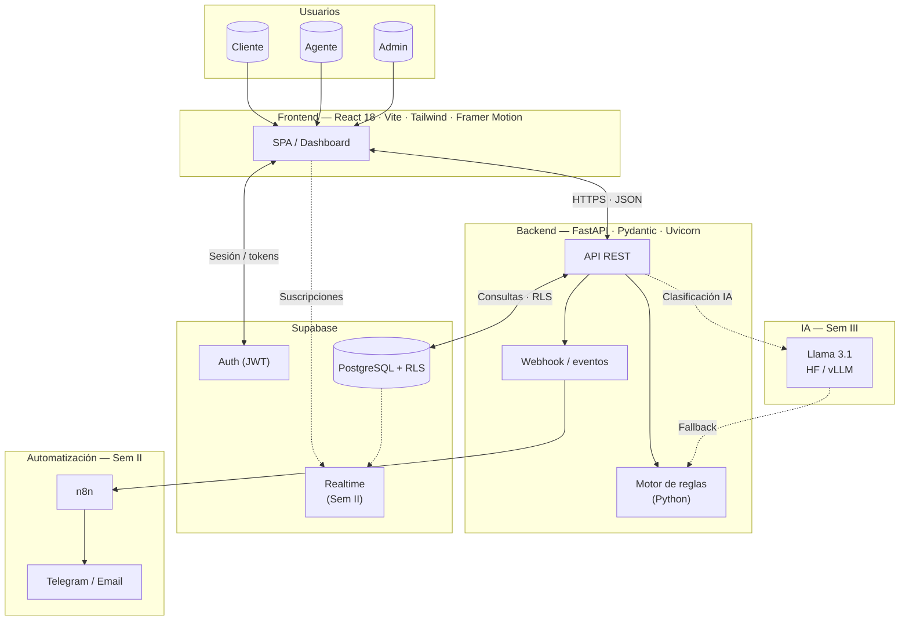
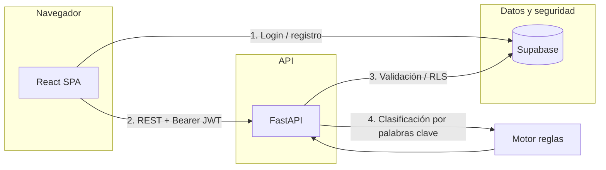
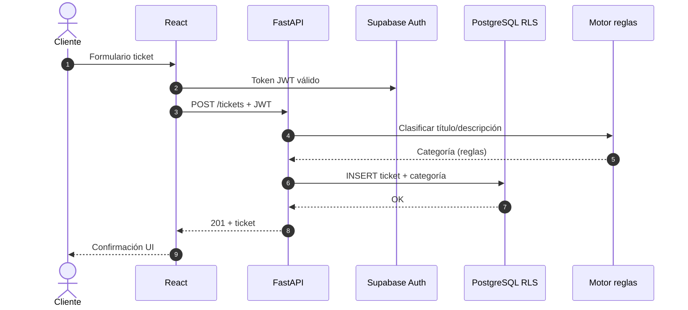
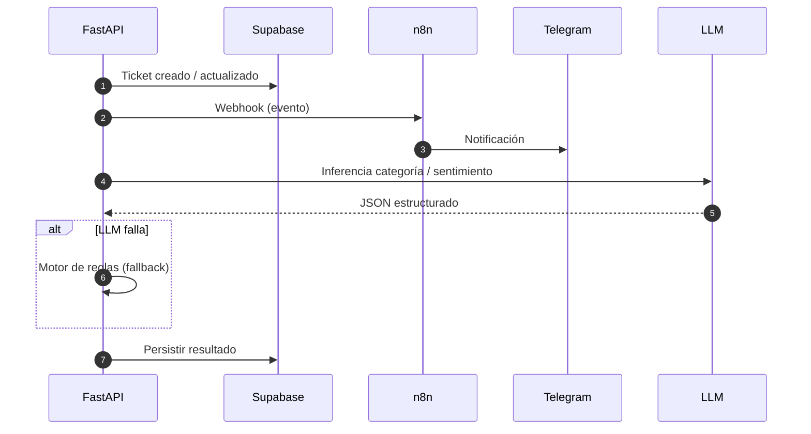
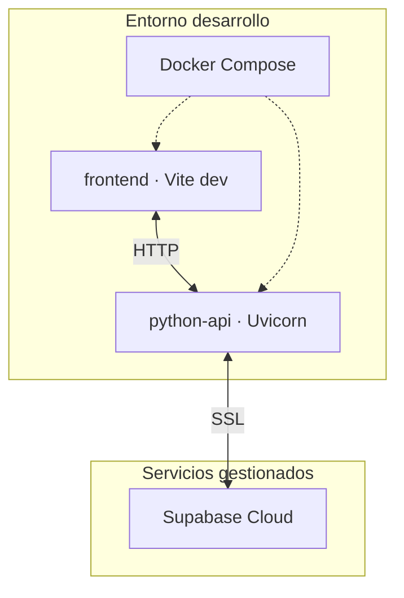

# Arquitectura de componentes y flujo de la aplicación

Documento visual del **AI Support Co-Pilot** (mesa de ayuda inteligente). Los diagramas usan [Mermaid](https://mermaid.js.org/) y se pueden ver en GitHub, GitLab, VS Code o cualquier visor compatible.

---

## 1. Diagrama de componentes (vista lógica)

Relación entre capas, tecnologías y servicios externos. Incluye alcance **actual (Sem I)** y **previsto (Sem II–III)**.

---

## 2. Flujo principal de la aplicación (peticiones)

Flujo simplificado desde el navegador hasta persistencia y reglas.

| Paso | Tecnología | Rol |
|------|------------|-----|
| 1 | Supabase Auth | Registro, login, roles (Cliente / Agente / Admin) |
| 2 | FastAPI + JWT | Endpoints de tickets, perfiles, dashboard |
| 3 | PostgreSQL + RLS | Datos aislados por rol |
| 4 | Python (reglas) | Categoría baseline antes del LLM (Sem III) |

---

## 3. Secuencia: creación de un ticket (cliente)

---

## 4. Secuencia: visión futura (webhook + n8n + LLM)

---

## 5. Despliegue local (referencia)

---

## Referencias

- Detalle de stack y diagramas previos: [`Entrega I/2. arquitectura_stack.md`](./Entrega%20I/2.%20arquitectura_stack.md)
- Procesos de negocio: [`Entrega I/3.modelado_de_procesos.md`](./Entrega%20I/3.modelado_de_procesos.md)
