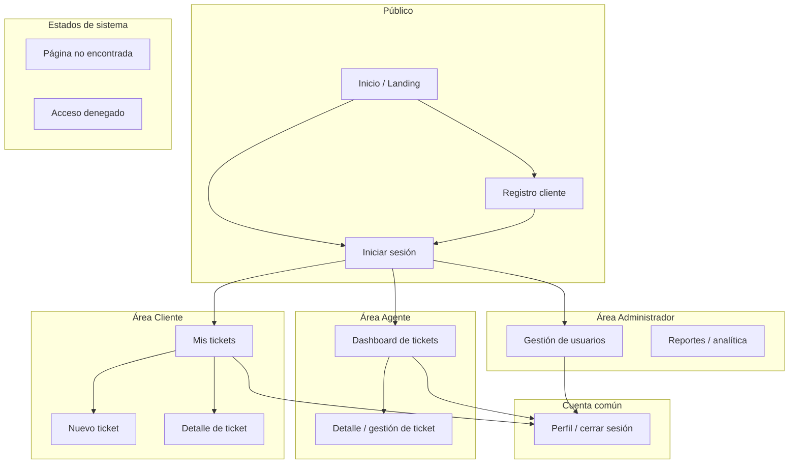

# Arquitectura de información — Proyecto de curso (AI Support Co-Pilot)

**Contexto:** aplicación web inteligente de mesa de ayuda (*ticketing*) alineada al proyecto integrador.  
**Alcance:** funcionalidades identificadas (auth, CRUD tickets por rol, dashboard agente, evolución IA/automatización).

**Objetivos de esta arquitectura de información (AI):**

1. Permitir que cada tipo de usuario **encuentre la siguiente acción correcta** sin sobrecarga cognitiva.  
2. Garantizar que los **contenidos** (tickets, usuarios) tengan **etiquetas y metadatos predecibles** para filtros, reportes y clasificación automática.  
3. Acotar **búsqueda y navegación** según **permisos**, evitando fugas de información entre roles.

---

## 1. Mapa del sitio

El mapa refleja **áreas por rol**, **profundidad URL** y **puntos de entrada/salida** coherentes con el modelo mental del usuario.

### 1.1 Diagrama (jerarquía lógica)



### 1.2 Árbol de rutas (convención REST-like)

```
/                           → Landing (público): enlaces a login y registro
/login                      → Formulario de autenticación
/registro                   → Alta de usuario cliente (opcional según política de negocio)

/mis-tickets                → Lista paginada de tickets del cliente actual
/mis-tickets/nuevo          → Creación de ticket (formulario)
/mis-tickets/:id            → Detalle de ticket (solo si user_id coincide)

/dashboard                  → Lista/tabla de todos los tickets (agente; permiso backend)
/dashboard/tickets/:id      → Detalle operativo (cambio de estado, lectura de categoría)

/admin/usuarios             → ABM o listado de usuarios (solo administrador)
/admin/reportes             → Paneles agregados (cuando existan en el producto)

/*                          → 404 (recurso inexistente)
/acceso-denegado            → 403 explícito (opcional ruta dedicada o modal)
```

### 1.3 Tabla detallada de vistas

| Ruta | Visibilidad | Objetivo de la pantalla | Contenido información dominante |
|------|-------------|-------------------------|-----------------------------------|
| `/` | Pública | Orientar y derivar a login/registro | Mensaje de valor, CTAs claros |
| `/login` | Pública | Identificar usuario | Credenciales; enlace a registro |
| `/registro` | Pública | Crear cuenta cliente | Email, contraseña, validaciones |
| `/mis-tickets` | Cliente autenticado | Inventario personal de casos | Tabla/tarjetas: título, estado, fecha |
| `/mis-tickets/nuevo` | Cliente | Registrar nuevo caso | Título, descripción; ayuda contextual |
| `/mis-tickets/:id` | Cliente (dueño) | Seguimiento de un caso | Metadatos del ticket, estado actual |
| `/dashboard` | Agente | Operar la cola global | Tabla densa, filtros, búsqueda |
| `/dashboard/tickets/:id` | Agente | Resolver caso | Acciones de estado, categoría visible |
| `/admin/usuarios` | Admin | Gobernanza de cuentas | Lista usuarios, rol, acciones |
| `/admin/reportes` | Admin | Visión analítica | Agregaciones por tiempo/categoría |

### 1.4 Parámetros de URL y estado de lista (opcional pero recomendado)

Para **compartir** o **marcar** vistas útiles del agente sin rediseñar el mapa:

| Parámetro (ejemplo) | Ámbito | Propósito |
|---------------------|--------|-----------|
| `?q=texto` | `/mis-tickets`, `/dashboard` | Sincronizar caja de búsqueda con URL (deep link a resultados filtrados). |
| `?estado=abierto` | Ambas listas | Filtro por taxonomía de estado. |
| `?desde=YYYY-MM-DD&hasta=YYYY-MM-DD` | Dashboard / reportes | Ventana temporal para auditoría y priorización. |
| `?pagina=2` | Listas | Paginación explícita en IA y SEO interno. |

*Justificación:* las URLs con estado hacen la IA **recuperable** (bookmark, pegar en chat interno) y documentable en manuales.

### 1.5 Justificación ampliada del mapa

- **Separación por rol:** reduce errores de uso y coincide con **RLS** en base de datos: la IA web debe reflejar las mismas fronteras que la política de datos.  
- **Profundidad controlada:** tres niveles típicos (`área → lista → detalle`) cumplen la **regla de 3 clics** para tareas frecuentes (crear ticket, cerrar ticket).  
- **`:id` estable:** los identificadores en URL permiten **enlaces directos** desde notificaciones futuras (n8n, correo) sin pasar siempre por la lista.  
- **Espacio `/admin/*`:** aísla vocabulario y expectativas de “configuración” vs “operación diaria” del agente.  
- **Rutas de error:** explicitar **404** y **403** en la IA evita pantallas en blanco que rompen la confianza del usuario.

---

## 2. Taxonomías y metadatos

### 2.1 Principios de diseño

| Principio | Aplicación en el proyecto |
|-----------|---------------------------|
| **Vocabulario controlado** | Estado, categoría y roles usan listas cerradas (o cerradas + “otro”). |
| **Separación usuario vs sistema** | El cliente escribe título/descripción; categoría y sentimiento pueden ser **asignados por sistema**. |
| **Traza única** | `id` + `created_at` permiten auditoría y orden inequívoco. |
| **No sinónimos en UI** | Una etiqueta por concepto en español en pantalla (“Abierto”, no mezclar “Open”). |

### 2.2 Objeto **Ticket** — especificación ampliada

| Metadato | Tipo técnico | Obligatorio en alta | Quién lo escribe | Validación / reglas |
|----------|--------------|----------------------|------------------|---------------------|
| `id` | UUID o BIGINT | — (generado) | Sistema | Inmutable, único |
| `titulo` | String (ej. 5–200 chars) | Sí | Cliente | No vacío; longitud máxima por UX |
| `descripcion` | Texto largo | Sí | Cliente | Mínimo razonable (ej. 20 chars) para evitar tickets vacíos |
| `estado` | Enum | Sí (default `abierto`) | Cliente implícito al crear; **Agente** al actualizar | Solo transiciones válidas (ver §2.5) |
| `categoria` | Enum | No en formulario cliente | **Motor de reglas / IA** | Normalización a vocabulario §2.4 |
| `sentimiento` | Enum opcional | No | **IA** (futuro) | Solo valores permitidos; nullable |
| `prioridad` | Enum opcional | No | Agente o sistema | Si no existe en v1, omitir de UI |
| `user_id` | FK usuario | Sí | Sistema al crear | Siempre = solicitante autenticado |
| `created_at` | ISO 8601 | — | Sistema | No editable por usuario |
| `updated_at` | ISO 8601 | — | Sistema | Actualizado en cada PATCH |

### 2.3 Objeto **Usuario** (metadatos relevantes para IA)

| Metadato | Uso en navegación y contenido |
|----------|-------------------------------|
| `id` | Referencia en tickets y auditoría |
| `email` | Login, recuperación, etiquetas read-only en admin |
| `rol` | Determina **árbol de sitio** visible y **consultas** permitidas |
| `nombre_display` (opcional) | Saludo en cabecera (“Hola, …”) sin exponer email completo si no se desea |

### 2.4 Taxonomía **categoría** (vocabulario cerrado sugerido)

| Valor canónico | Etiqueta en UI | Cuándo usar |
|----------------|----------------|-------------|
| `tecnico` | Técnico | Fallos de software, hardware, conectividad |
| `facturacion` | Facturación | Cobros, facturas, planes |
| `acceso` | Acceso / cuentas | Credenciales, permisos, bloqueos |
| `general` | General | Consultas no clasificadas aún |
| `otro` | Otro | Texto no encaja; revisión manual o mejora de reglas |

*Sinónimos en motor de reglas:* palabras clave pueden **mapear** a estos valores; la IA nunca debería inventar un sexto valor sin ampliar el esquema.

### 2.5 Taxonomía **estado** y transiciones

| Estado | Visible cliente | Visible agente | Notas |
|--------|-----------------|----------------|-------|
| `abierto` | Sí | Sí | Estado inicial |
| `cerrado` | Sí | Sí | Caso resuelto o cerrado administrativamente |
| `en_proceso` (opcional) | Sí | Sí | Si el producto quiere feedback intermedio |

**Transiciones recomendadas (máquina de estados simplificada):**

```
abierto → cerrado
abierto → en_proceso → cerrado   (si existe en_proceso)
cerrado → abierto               (solo si política de “reapertura” existe)
```

La IA debe **mostrar siempre el estado actual** en la misma posición (p. ej. badge junto al título) para escaneo rápido.

### 2.6 Taxonomía **sentimiento** (preparación IA, opcional en v1)

| Valor | Uso |
|-------|-----|
| `neutral` | Por defecto si no hay modelo |
| `positivo` | Tono tranquilo o agradecido |
| `negativo` | Posible alerta o priorización en automation |

### 2.7 Metadatos de **presentación** (capa UI, no BD obligatoria)

| Elemento | Regla |
|----------|--------|
| **Breadcrumbs** | Misma cadena de conceptos que la URL: `Mis tickets > Detalle #42` |
| **Título de página (`<title>`)** | Incluir nombre app + vista + id corto en detalle para pestañas múltiples |
| **Etiquetas de filtro** | Deben coincidir **literalmente** con valores canónicos del backend para no duplicar opciones (“Técnico” ↔ `tecnico`) |

### 2.8 Justificación de taxonomías cerradas

- **Reportes:** gráficas por categoría y estado requieren cardinalidad baja y estable.  
- **Clasificación automática:** el modelo o las reglas deben **emitir** valores del mismo conjunto que consume el filtro.  
- **Accesibilidad:** listas cerradas permiten **radios** o **select** con pocas opciones frente a entrada libre inconsistente.

---

## 3. Navegabilidad

### 3.1 Matriz rol × ítems de menú

| Ítem | Cliente | Agente | Admin |
|------|---------|--------|-------|
| Mis tickets | ✓ | — | — |
| Nuevo ticket | ✓ | — | — |
| Dashboard | — | ✓ | opcional |
| Usuarios | — | — | ✓ |
| Reportes | — | — | ✓ |
| Cerrar sesión | ✓ | ✓ | ✓ |

Los ítems **no disponibles** no se muestran (preferible a mostrar deshabilitados sin explicación).

### 3.2 Flujo post-autenticación

1. Usuario envía credenciales válidas.  
2. Sistema determina `rol`.  
3. **Redirección forzada:** `cliente` → `/mis-tickets`; `agente` → `/dashboard`; `administrador` → `/admin/usuarios` o `/dashboard` según política única del producto.  
4. Intento de visitar ruta de otro rol → **403** o redirección a “home” del rol con mensaje breve.

*Justificación:* evita que el usuario caiga en una pantalla “correcta por URL pero incorrecta por permiso” sin feedback.

### 3.3 Contexto dentro del detalle del ticket

| Elemento | Función |
|----------|---------|
| **Cabecera** | Título + estado + fecha + categoría (si existe) |
| **Cuerpo** | Descripción completa |
| **Acciones primarias** | Cliente: volver; Agente: cambiar estado / guardar |
| **Historial** | Si el producto lo incorpora más adelante, ubicarlo **debajo** del cuerpo para no competir con la lectura inicial |

### 3.4 Patrones transversales

- **Menú persistente** en layout autenticado (superior o lateral); mismo orden en todas las vistas del rol.  
- **Indicador de ubicación activa** (resaltar ítem de menú correspondiente a la ruta actual).  
- **“Volver”** secundario a breadcrumbs para usuarios menos familiarizados con jerarquía.  
- **Sesión expirada:** redirección a `/login` con **mensaje** y, si es posible, `returnUrl` para retorno post-login (mejora continuidad sin rediseñar mapa).

### 3.5 Navegabilidad en escenarios de error

| Situación | Comportamiento IA |
|-----------|-------------------|
| Ticket `:id` inexistente | 404 amigable + enlace a lista |
| Ticket ajeno (cliente) | 403 o 404 opaco (seguridad por oscuridad, según política) |
| Red sin respuesta | Estado de error reusable con “reintentar” |

### 3.6 Responsive (consideración IA)

- En **móvil**, el menú puede colapsar a **icono hamburguesa**, pero el **orden de prioridad** de ítems se mantiene: cliente primero “Mis tickets” y “Nuevo”.  
- Tablas anchas del agente: **scroll horizontal** explícito o **vista tarjeta** alternativa para no perder filas críticas.

### 3.7 Justificación global de navegabilidad

La navegación **por rol** reduce la **carga de decisión** y evita exponer modelos mentales incompatibles en un mismo menú. Los **patrones repetibles** (lista → detalle → volver) aceleran el aprendizaje en usuarios ocasionales y en agentes con alto volumen.

---

## 4. Mecanismos de búsqueda

### 4.1 Modelo conceptual: capas

| Capa | Descripción |
|------|-------------|
| **Ámbito** | Subconjunto de tickets autorizados (mis tickets vs todos los operables). |
| **Consulta de texto** | Coincidencia sobre `titulo` y/o `descripcion`. |
| **Filtros estructurados** | Estado, categoría, fechas (metadatos §2). |
| **Orden** | Campo + dirección (asc/desc). |
| **Paginación** | Offset/limit o cursor según backend |

### 4.2 Alcance por rol (detalle operativo)

| Rol | Ámbito por defecto | Campos buscables | Filtros UI |
|-----|-------------------|------------------|------------|
| **Cliente** | `user_id = yo` | Título, descripción | Estado (opcional) |
| **Agente** | Todos los visibles por política servidor | Título, descripción | Estado, categoría, rango fechas |
| **Admin (reportes)** | Agregados / export | N/A en misma pantalla que operativo | Dimensión tiempo, categoría, volumen |

### 4.3 Comportamiento de la caja de búsqueda

| Aspecto | Recomendación |
|---------|----------------|
| **Debounce** | 300–500 ms tras dejar de escribir para limitar peticiones. |
| **Mínimo de caracteres** | Opcional (ej. 2) para evitar consultas demasiado amplias en tablas grandes. |
| **Vacío de consulta** | Mostrar lista completa del ámbito (comportamiento habitual). |
| **Sin resultados** | Mensaje: “No hay tickets que coincidan. Prueba otro texto o quita filtros.” |
| **Reset** | Botón “Limpiar filtros” visible cuando hay algo activo |

### 4.4 Ordenación en tablas

| Vista | Orden por defecto | Columnas ordenables sugeridas |
|-------|-------------------|--------------------------------|
| Mis tickets | `updated_at` desc | Fecha, estado |
| Dashboard agente | `created_at` desc | Fecha creación, estado, categoría |

*Justificación:* el agente suele atender **FIFO** por llegada; el cliente prioriza **última actividad** en sus casos.

### 4.5 Paginación y rendimiento

- Tamaño de página sugerido **10–25** filas para equilibrio entre scroll y peticiones.  
- Mostrar **total aproximado** o “Mostrando X–Y” para orientación en colas grandes.  
- Evitar cargar **descripciones completas** en la tabla lista: solo en detalle (reduce peso y mejora escaneo).

### 4.6 Evolución: IA y búsqueda

- **Fase actual:** búsqueda **literal** (substring o índice de texto).  
- **Fase futura:** embeddings o ranking por relevancia; los **metadatos §2** siguen siendo pivotes para filtros híbridos (“negativo + abierto + últimos 7 días”).  
- **Transparencia:** si un resultado viene de sugerencia IA, etiqueta breve (“Relacionado con tu búsqueda”) sin ocupar arquitectura URL nueva.

### 4.7 Justificación de la política de búsqueda

Restringir al cliente su **propio subconjunto** es requisito de **privacidad** y de modelo mental (“solo mis cosas”). Dar al agente **filtros compuestos** reduce tiempo de **triaje** y es estándar en herramientas de referencia del dominio.

---

## 5. Etiquetado, iconografía y coherencia

| Área | Directriz |
|------|-----------|
| Estados | Mismo color semántico en lista y detalle (ej. verde/gris para cerrado). |
| Categorías | **Chip** o etiqueta secundaria, no competir con el título. |
| Acciones destructivas | Confirmación antes de transiciones irreversibles si el negocio las define. |

*(Las decisiones visuales finales se documentan en guías de estilo de UI; aquí la IA solo fija **qué conceptos** existen y **dónde** aparecen.)*

---

## 6. Síntesis de decisiones

| Decisión | Detalle | Razón |
|----------|---------|-------|
| Mapa en ramas por rol + público | Rutas `/mis-tickets`, `/dashboard`, `/admin/*` | Seguridad, claridad mental, escalabilidad |
| URLs con estado opcional (`?q=`, filtros) | Deep linking en listas | Recuperabilidad y soporte |
| Taxonomías cerradas | Estado, categoría, roles | Informes, filtros, IA consistente |
| Metadatos sistema vs usuario | Categoría/sentimiento por backend | Menos fricción en alta del cliente |
| Navegación mínima por rol | Sin mega-menú | Carga cognitiva baja |
| Búsqueda dual | Cliente acotado / agente amplio | Privacidad vs eficiencia |
| Paginación + orden explícitos | Tablas operativas | Rendimiento y predictibilidad |

---

## Referencias internas

- Funcionalidades y usuarios: `docs/prototipo_ui_analisis_contexto.md`, `docs/Entrega I/5.backlog_historias.md`.  
- Flujos de negocio: `docs/Entrega I/3.modelado_de_procesos.md`.

---

*Entregable — Arquitectura de información del proyecto de curso (diagramas, descripciones y justificaciones ampliadas).*
